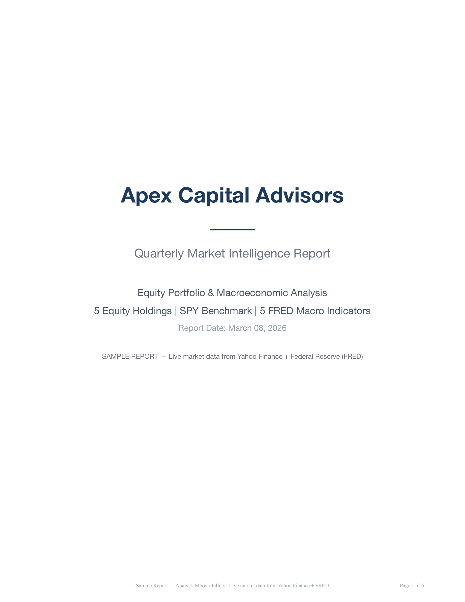
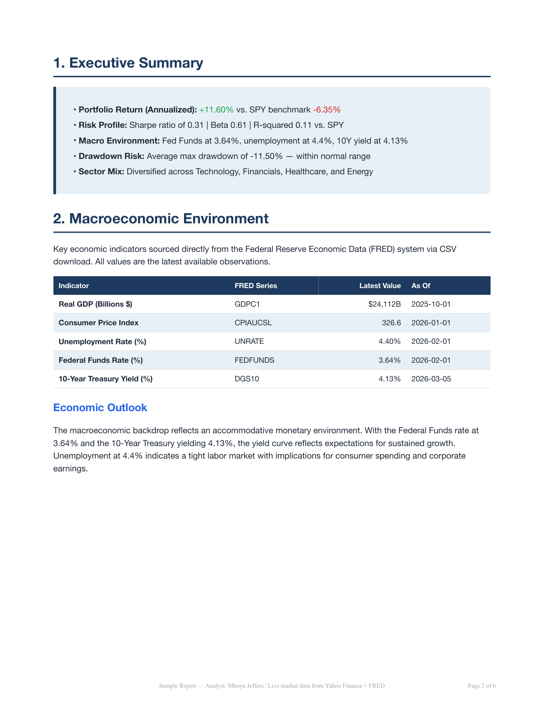
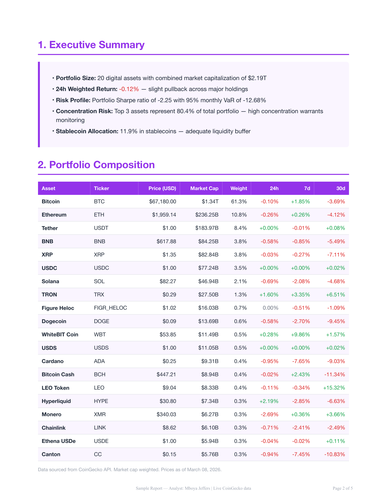
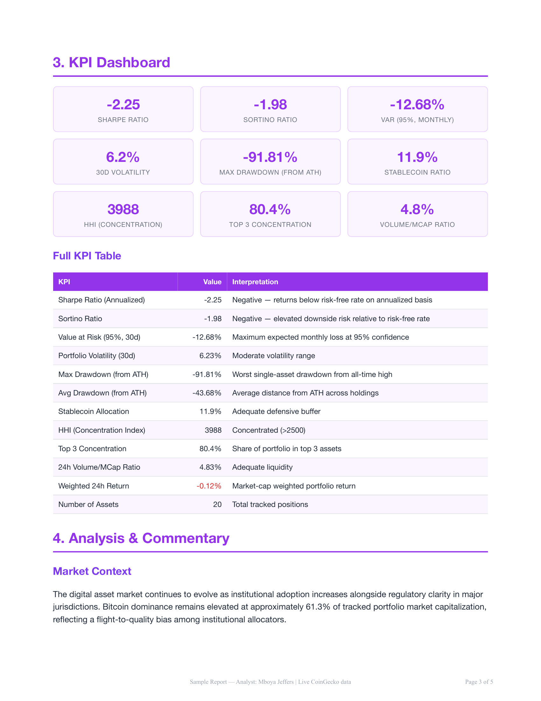
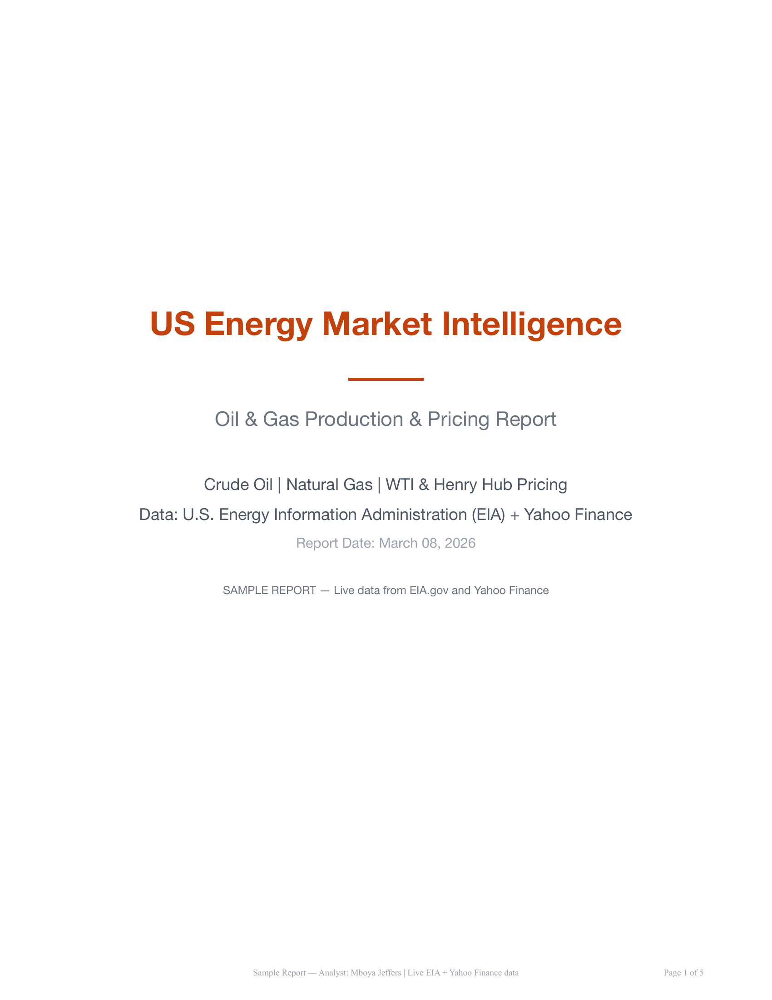
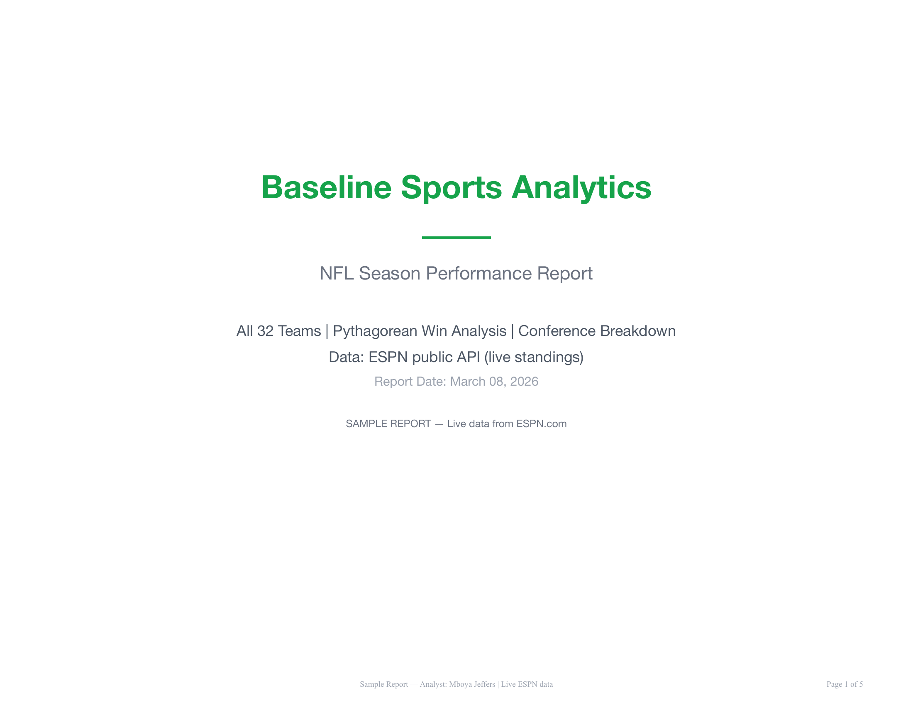
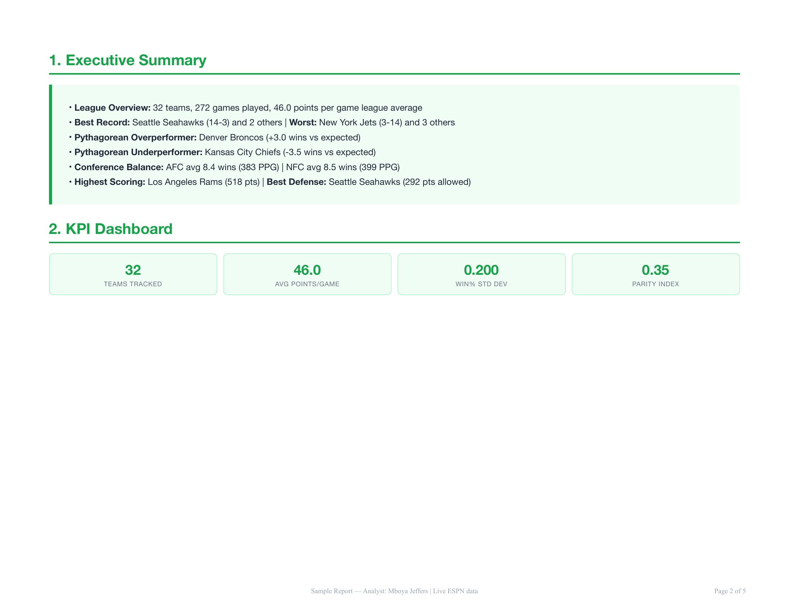
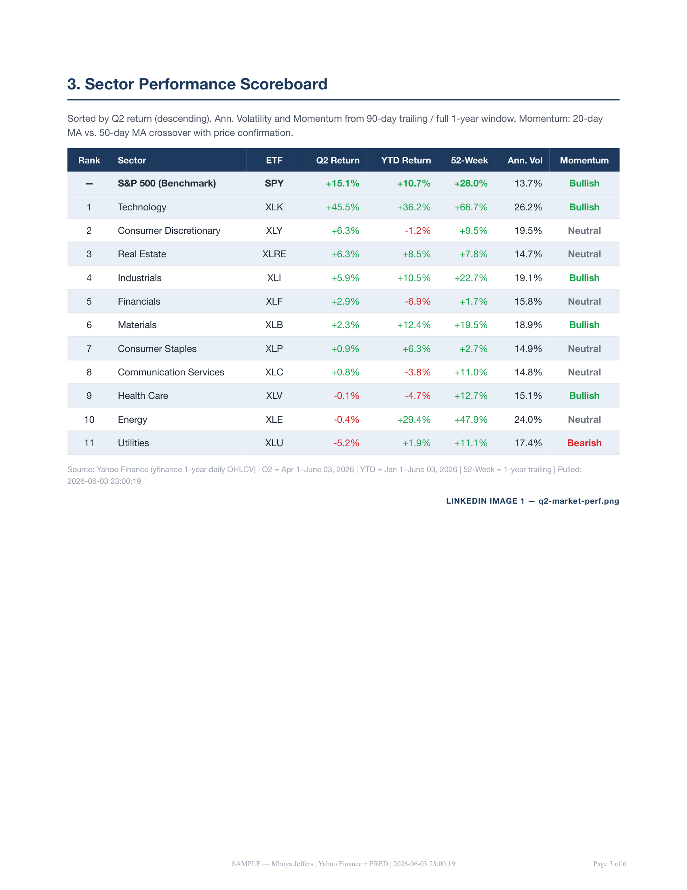
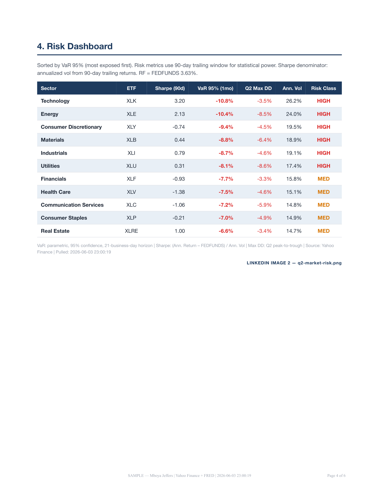

> **Archived — consolidated into [financial-market-analysis](https://github.com/mboyajeffers/financial-market-analysis).** All unique content from this repo now lives there. This repo is kept for history only.

# Data Analytics Report Samples

Automated analytics reports built on a production data infrastructure — financial markets, crypto, energy, and sports verticals. Every report pulls from live public APIs and delivers independently verifiable data with source attribution and pull timestamps.

---

## What's in This Repo

| Report | Vertical | Data Source | File |
|--------|----------|-------------|------|
| Financial Markets Report | Equity / Macro | Yahoo Finance + FRED | [View PDF](reports/finance/Sample_Financial_Analytics_Report.pdf) |
| Crypto Portfolio Analysis | Digital Assets | CoinGecko | [View PDF](reports/crypto/Sample_Crypto_Portfolio_Report.pdf) |
| Energy & Oil/Gas Intelligence | Energy / Commodities | EIA API + Yahoo Finance | [View PDF](reports/energy/Sample_Energy_Compliance_Report.pdf) |
| Sports Analytics Report | Sports / Betting | ESPN | [View PDF](reports/sports/Sample_Sports_Analytics_Report.pdf) |
| Q2 2026 Market Intelligence | Multi-sector | Yahoo Finance + FRED | [View PDF](reports/market-intelligence/Q2_2026_Market_Intelligence_Report.pdf) |

---

## Sample Previews

### Financial Markets

### Crypto Portfolio

### Energy & Oil/Gas

### Sports Analytics

### Q2 2026 Market Intelligence

---

## What I Build

- **Automated report pipelines** — weekly, monthly, or quarterly PDF delivery from live APIs
- **Star schema data warehouses** — fact/dimension modeling, tested ETL, production-grade
- **Industry-specific KPI libraries** — financial, crypto, energy, sports verticals
- **Custom data pipelines** — any public or private data source, structured for analysis

**Stack:** Python, PostgreSQL, live API integrations (Yahoo Finance, FRED, EIA, CoinGecko, ESPN), automated PDF generation, 500+ automated tests, 3M+ rows of seeded historical data.

All report figures are independently verifiable — source URL and data pull timestamp included on every page.

---

## Work With Me

**Available for:**
- Custom analytics reports ($200–$900/report)
- Automated report pipelines ($500–$2,500 setup)
- Monthly analytics retainers ($1,000–$5,000/month)
- Equity or revenue-share arrangements for early-stage companies

**LinkedIn:** [linkedin.com/in/mboya-jeffers-6377ba325](https://linkedin.com/in/mboya-jeffers-6377ba325)

---

*All sample reports use fictional company and fund names for demonstration. All underlying data is real and sourced from public APIs at the timestamps shown in each report.*
